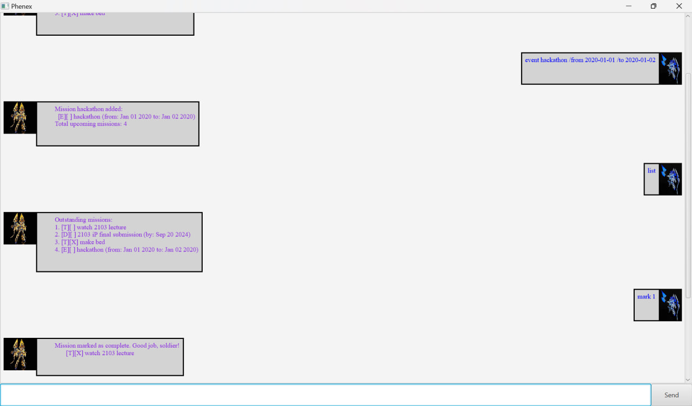

# User Guide for Phenex Chatbot

Phenex is your favourite gundam-themed chatbot,
meant to help you keep track of your tasks through maintaining a task list! 
Phenex supports 3 different task types: ToDo, Deadline, and Event.
It also comes in two forms - a GUI version, or a CLI version.

## Features

### Notes about the Command Format:

- Words in `{}` are parameters to be supplied by the user.  
  e.g. in `todo {description}`, `description` is a parameter which can be used as `todo Buy groceries`.

- Parameters must be provided in the order specified by the command.

### Adding a New Todo task to the task list: `todo`

Adds a new todo task to the task list.

**Format:** `todo (description)`

**Example:**
- `todo go grocery shopping`

### Adding a New Deadline: `deadline`

Adds a new deadline task to the task list, meant for tasks which must be done by a certain date.

**Format:** `deadline (description) /by (YYYY-MM-DD)`

**Example:**
- `deadline pay for gym membership /by 2024-12-25`

### Adding a New Event: `event`

Adds a new event task to the task list with a start date and an end date, meant for tasks which occur during a period.

**Format:** `event (description) /from (YYYY-MM-DD) /to (YYYY-MM-DD)`

**Examples:**
- `event holiday /from 2024-12-01 /to 2024-12-15`

### Listing All Tasks: `list`

Displays all tasks in the current task list.

**Format:** `list`

### Marking a Task as Complete: `mark`

Marks a task at the specified index as completed. The `index` is the task's position in the list. 
Index will be an integer starting from 1.

**Format:** `mark (index)`

**Example:**
- `mark 2`

### Unmarking a Task as Incomplete: `unmark`

Marks a task at the specified index as incomplete. The `index` is the task's position in the list.
Index will be an integer starting from 1.

**Format:** `unmark (index)`

**Example:**
- `unmark 2`

### Deleting a Task: `delete`

Deletes a task at the specified index from the task list. The `index` is the task's position in the list.

**Format:** `delete (index)`

**Example:**
- `delete 6`

### Finding a Task: `find`

Finds a task in the list which has a specified description.

**Format:** `find (description)`

**Example:**
- `find holiday`

### Finding a Task by date: `missions on`

Finds a task in the list which has a specified date.

**Format:** `find (YYYY-MM-DD)`

**Example:**
- `missions on 2020-01-01`

### Exiting the Program: `bye`

Saves current task list and terminates the session for Phenex.

**Format:** `bye`